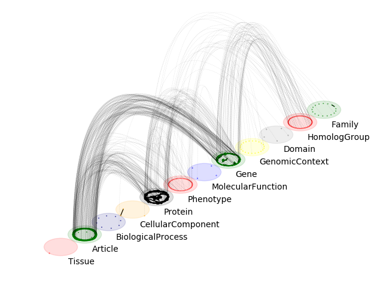
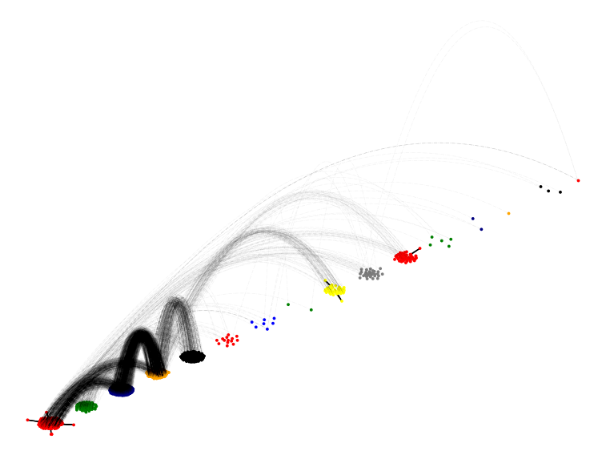
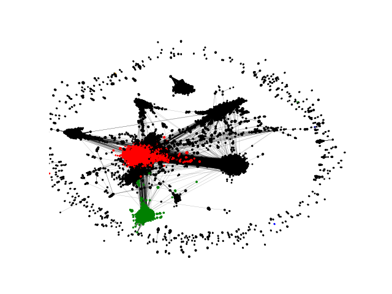
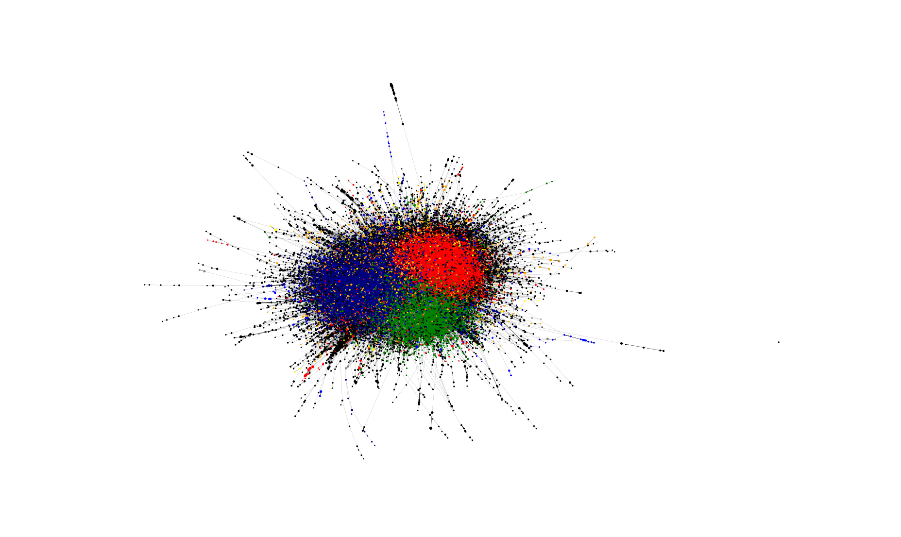
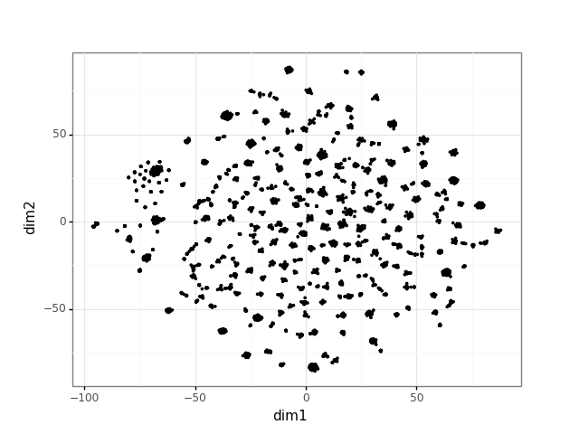

# *Py3Plex* - a library for analysis and visualization of heterogeneous networks

Heterogeneous networks are complex networks with additional information assigned to nodes or edges (or both). This library includes
some of the state-of-the-art algorithms for decomposition, visualization and analysis of such networks.


Heterogeneous (multilayer) networks             |  Homogeneous networks
:-------------------------:|:-------------------------:
  |  

## Getting Started

To get started, please view **examples** folder. Extensive documentation is available at: https://skblaz.github.io/Py3Plex/
### Prerequisites

1. Networkx (2.1)
2. Numpy (0.8)
3. Scipy  (1.1.0)
4. RDFlib (for ontology-based tasks) (any)

### Installing

To install, simply:

```
python3 setup.py install
```

You can also try:
```
pip3 install py3plex
```
yet this version is updated only on larger updates!

### Examples

Here are some showcase examples! (**run from the ./examples folder!**)

**Some simple statistics**
```python

from py3plex.core import multinet
from py3plex.algorithms.statistics.basic_statistics import *

multilayer_network = multinet.multi_layer_network().load_network("../datasets/imdb_gml.gml",directed=True,input_type="gml")

stats_frame = core_network_statistics(multilayer_network.core_network)
print(stats_frame)

top_n_by_degree = identify_n_hubs(multilayer_network.core_network,20)
print(top_n_by_degree)

```

**Network decomposition**
What is network decomposition? Does your network consist of multiple node types? Are there directed edges present? If so, information from the whole network can be used to construct artificial edges between the nodes of a user-defined type (defined using node triplets). This way, a heterogeneous network can be simplified to a homogeneous one, useful for e.g., machine learning tasks!
```python
from py3plex.core import multinet
from py3plex.algorithms.node_ranking import sparse_page_rank, stochastic_normalization_hin
from py3plex.algorithms.benchmark_classification import *

dataset = "../datasets/labeled_epigenetics.gpickle"

multilayer_network = multinet.multi_layer_network().load_network(input_file=dataset,directed=True,input_type=dataset.split(".")[-1])

print ("Running optimization for {}".format(dataset))
multilayer_network.basic_stats() ## check core imports        
triplet_set = list(set(multilayer_network.get_decomposition_cycles()))
print(triplet_set)
for decomposition in multilayer_network.get_decomposition(heuristic=["idf","rf"], cycle=triplet_set, parallel=True):
    print(decomposition)
```

**Multilayer visualization**

```python
from py3plex.visualization.multilayer import *
from py3plex.visualization.colors import all_color_names,colors_default
from py3plex.core import multinet

## multilayer
multilayer_network = multinet.multi_layer_network().load_network("../datasets/goslim_mirna.gpickle",directed=False, input_type="gpickle_biomine")
multilayer_network.basic_stats() ## check core imports
network_labels, graphs, multilinks = multilayer_network.get_layers() ## get layers for visualization
#print(network_labels,graphs)
draw_multilayer_default(graphs,display=False,background_shape="circle",labels=network_labels)

enum = 1
color_mappings = {idx : col for idx, col in enumerate(colors_default)}
for edge_type,edges in multilinks.items():
    draw_multiedges(graphs,edges,alphachannel=0.2,linepoints="-.",linecolor=color_mappings[enum],curve_height=5,linmod="upper",linewidth=0.4)
    enum+=1
plt.show()

### basic string layout
multilayer_network = multinet.multi_layer_network().load_network("../datasets/imdb_gml.gml",directed=False,label_delimiter="---")
network_colors, graph = multilayer_network.get_layers(style="hairball")
hairball_plot(graph,network_colors)
plt.show()
```



**Network community visualization**
```python

from py3plex.algorithms.community_detection import community_wrapper as cw
from py3plex.core import multinet
from py3plex.visualization.multilayer import *
from py3plex.visualization.colors import colors_default
from collections import Counter

import argparse

parser = argparse.ArgumentParser()
parser.add_argument("--input_network",default="../datasets/cora.mat")
parser.add_argument("--input_type",default="sparse")
args = parser.parse_args()

network = multinet.multi_layer_network().load_network(input_file=args.input_network,directed=False,input_type=args.input_type) ## network and group objects must be present within the .mat object

network.basic_stats() ## check core imports

partition = cw.louvain_communities(network.core_network)

## select top n communities by size
top_n = 10
partition_counts = dict(Counter(partition.values()))
top_n_communities = list(partition_counts.keys())[0:top_n]

## assign node colors
color_mappings = dict(zip(top_n_communities,colors_default[0:top_n]))

network_colors = [color_mappings[partition[x]] if partition[x] in top_n_communities else "black" for x in network.get_nodes()]

## visualize the network's communities!
hairball_plot(network.core_network,color_list = network_colors,layered=False,layout_parameters={"iterations" : 50},scale_by_size=True,layout_algorithm="force",legend=False)
plt.show()

```



Or if run as

```python
python3 example_community_detection.py --input_network ~/Downloads/soc-Epinions1.txt.gz --input_type edgelist
```



**Network Embedding visualization**
```python
from py3plex.core import multinet
from py3plex.wrappers import train_node2vec_embedding
from py3plex.visualization import embedding_visualization
import json

## load network in GML
multilayer_network = multinet.multi_layer_network().load_network("../datasets/imdb_gml.gml",directed=True,input_type="gml")

## save this network as edgelist for node2vec
multilayer_network.save_network("../datasets/test.edgelist")

## call a specific embedding binary --- this is not limited to n2v
train_node2vec_embedding.call_node2vec_binary("../datasets/test.edgelist","../datasets/test_embedding.emb",binary="../bin/node2vec",weighted=False)

## preprocess and check embedding
multilayer_network.load_embedding("../datasets/test_embedding.emb")

## visualize embedding
embedding_visualization.visualize_embedding(multilayer_network)

## output embedded coordinates as JSON
output_json = embedding_visualization.get_2d_coordinates_tsne(multilayer_network,output_format="json")

with open('../datasets/embedding_coordinates.json', 'w') as outfile:
    json.dump(output_json, outfile)
```


# Citation

```
@InProceedings{10.1007/978-3-319-78680-3_13,
author="{\v{S}}krlj, Bla{\v{z}}
and Kralj, Jan
and Vavpeti{\v{c}}, An{\v{z}}e
and Lavra{\v{c}}, Nada",
editor="Appice, Annalisa
and Loglisci, Corrado
and Manco, Giuseppe
and Masciari, Elio
and Ras, Zbigniew W.",
title="Community-Based Semantic Subgroup Discovery",
booktitle="New Frontiers in Mining Complex Patterns",
year="2018",
publisher="Springer International Publishing",
address="Cham",
pages="182--196",
abstract="Modern data mining algorithms frequently need to address learning from heterogeneous data and knowledge sources, including ontologies. A data mining task in which ontologies are used as background knowledge is referred to as semantic data mining. A special form of semantic data mining is semantic subgroup discovery, where ontology terms are used in subgroup describing rules. We propose to enhance ontology-based subgroup identification by Community-Based Semantic Subgroup Discovery (CBSSD), taking into account also the structural properties of complex networks related to the studied phenomenon. The application of the developed CBSSD approach is demonstrated on two use cases from the field of molecular biology.",
isbn="978-3-319-78680-3"
}

@article{kralj2018hinmine,
  title={HINMINE: heterogeneous information network mining with information retrieval heuristics},
  author={Kralj, Jan and Robnik-{\v{S}}ikonja, Marko and Lavra{\v{c}}, Nada},
  journal={Journal of Intelligent Information Systems},
  volume={50},
  number={1},
  pages={29--61},
  year={2018},
  publisher={Springer}
}

```
