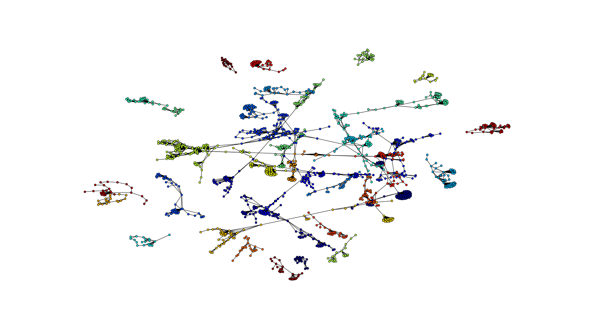

# Py3Plex
## a library for analysis and visualization of heterogeneous networks

Heterogeneous networks are complex networks with additional information assigned to nodes or edges (or both). This library includes
some of the state-of-the-art algorithms for decomposition and analysis of such algorithms.




## Getting Started

To get started, please view **examples** folder.
### Prerequisites

1. Networkx (2.1)
2. Numpy (0.8)
3. Scipy  (1.1.0)
4. RDFlib (for ontology-based tasks) (any)

### Installing

To install, simply:

```
python3 setup.py install
```

### Examples

Here are some showcase examples!


**Network decomposition**
```python
from py3plex.core import multinet
from py3plex.algorithms.node_ranking import sparse_page_rank, stochastic_normalization_hin
from py3plex.algorithms.benchmark_classification import *

dataset = "../datasets/labeled_epigenetics.gpickle"

multilayer_network = multinet.multi_layer_network().load_network(input_file=dataset,directed=True,input_type=dataset.split(".")[-1])

print ("Running optimization for {}".format(dataset))
multilayer_network.basic_stats() ## check core imports        
triplet_set = list(set(multilayer_network.get_decomposition_cycles()))
print(triplet_set)
for decomposition in multilayer_network.get_decomposition(heuristic=["idf","rf"], cycle=triplet_set, parallel=True):
    print(decomposition)
```

**Multilayer visualization**


```python
from py3plex.visualization.multilayer import *
from py3plex.visualization.colors import all_color_names
from py3plex.core import multinetk

## multilayer
multilayer_network = multinet.multi_layer_network().load_network("../datasets/epigenetics.gpickle",directed=False, input_type="gpickle_biomine")
multilayer_network.basic_stats() ## check core imports
network_labels, graphs, multilinks = multilayer_network.get_layers() ## get layers for visualization
#print(network_labels,graphs)
draw_multilayer_default(graphs,display=False,background_shape="circle",labels=network_labels)

enum = 1
color_mappings = {idx : col for idx, col in enumerate(list(all_color_names.keys()))}
for edge_type,edges in multilinks.items():
    draw_multiedges(graphs,edges,alphachannel=0.7,linepoints="-.",linecolor=color_mappings[enum],curve_height=5,linmod="upper",linewidth=0.4)
    enum+=1
plt.show()
```
